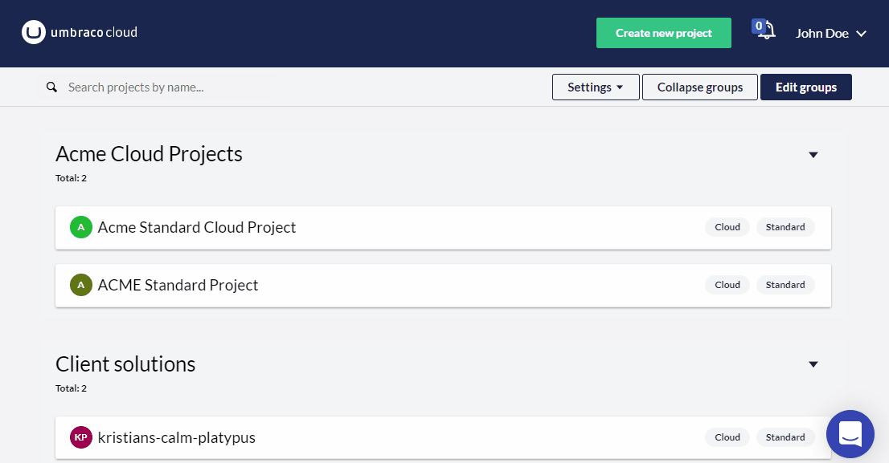
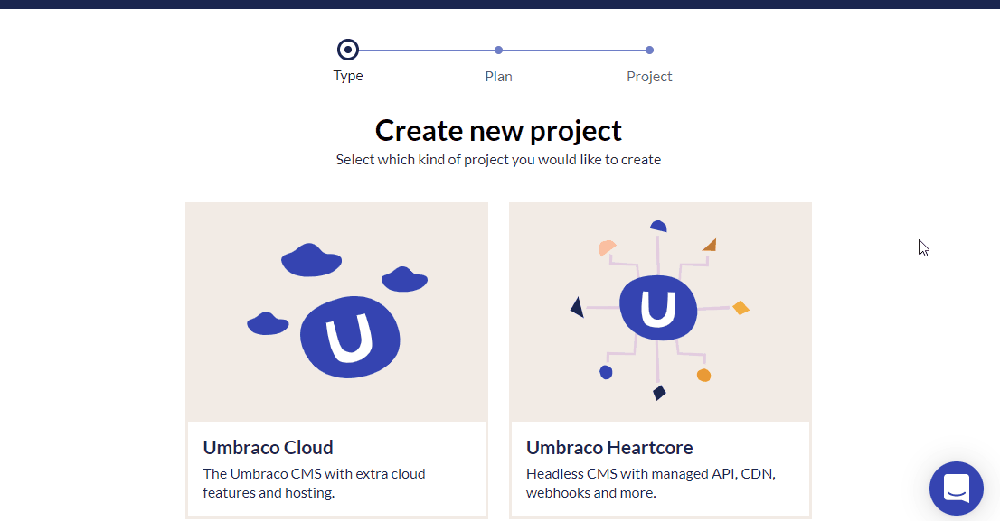

# September 2022

## Highlights video


Cloud highlights September 2022


## [MFA authentication](../../set-up/multi-factor-authentication-on-cloud.md)

On Umbraco Cloud, you can add MFA in a few steps for your Umbraco Cloud account.

You can either use **Email**, **Phone**, or an **Authenticator App** when logging in to the Cloud Portal.

To enable MFA for Umbraco Cloud, go to **Profile**, click **Edit Profile**, and select the **Multifactor Authentication Method** from the drop-down list.

MFA code can be sent either to your email or as a text message on your phone. Alternatively, you can use an authentication app such as Google Authenticator, Authy, or similar.

As your Umbraco profile is used to log in to the backoffice for your projects, these are all now protected with MFA.

## US Region Hosting

Until now, Umbraco Cloud has been exclusively hosted in the West Europe region on Azure. Including **East US** as an option and offering regional hosting to agencies, partners, and end-clients located in the US is a big milestone.

You can select which region you would like to host your Umbraco Cloud project while creating a new Cloud project.

As excited as we are about making Umbraco Cloud available in the US, we also have the ability to expand to **new regions**. If you have specific requests regarding the next region you want Umbraco Cloud to expand to, let us know at product@umbraco.com.

See the blog article [Umbraco Cloud expands with US regional hosting](https://umbraco.com/blog/umbraco-cloud-expands-with-us-regional-hosting/) for more information.

## Projects Dashboard

Have you tried the new Projects Dashboard yet? The first official version of the dashboard has been released.

Currently, you can find a link in the project's overview. Soon the Projects Dashboard will be the default landing page after logging into Umbraco Cloud Portal.

By clicking on “Edit groups”, you can sort projects into groups with the drag-drop functionality to organize your Cloud and Heartcore projects.

After saving your projects, you can choose between a detailed view with relevant information for your projects such as environments, product versions, and bandwidth/media storage usage, or a more compact view with less information. You can decide by using the “Settings” option.

You can try out the Projects Dashboard on https://www.s1.umbraco.io/projectsdashboard and start grouping the Cloud projects as per your preference. We will add new features and functionality to the dashboard in future releases starting with a filtering system as one of the next new additions.
